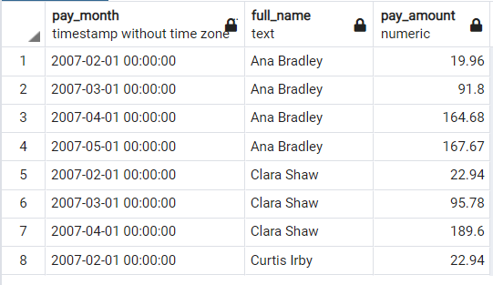

#  Sakila DVD Rental database investigation 

## Overview

In this project, I used SQL to explore a database related to movie rentals. Wrote  SQL code to run SQL queries and answer interesting questions about the database. build visualizations to showcase the output of the queries using PostgreSQL.


## ER Diagram 


## Question 1

We want to understand more about the movies that families are watching. The following categories are considered family movies: Animation, Children, Classics, Comedy, Family and Music.

Create a query that lists each movie, the film category it is classified in, and the number of times it has been rented out.

```
SELECT f.title AS film_title , c.name AS category_name , COUNT(*) AS rental_count
FROM category c
JOIN film_category fc
ON c.category_id = fc.category_id
JOIN film f
ON f.film_id = fc.film_id
JOIN inventory i
ON i.film_id = f.film_id
JOIN rental r 
ON  r.inventory_id = i.inventory_id
WHERE c.name = 'Animation' OR c.name = 'Children' OR c.name = 'Classic' OR c.name = 'Comedy'
OR c.name = 'Family' OR c.name = 'Music'
GROUP BY 1,2 
ORDER BY 2;
```

[SQL file](./queries/q1.sql)

### sample output of query 
<br>


<br>

### Histogram of different categories rental frequency 
<br>


## Question 2


Now we need to know the length of rental duration of these family-friendly movies compared to the duration that all movies are rented for. providing a table with the movie titles and dividing them into **4 levels (first_quarter, second_quarter, third_quarter, and final_quarter) based on the quartiles (25%, 50%, 75%)** of the rental duration for movies across all categories.

```
SELECT f.title AS film_title , c.name AS category_name , f.rental_duration , NTILE(4) OVER (ORDER BY f.rental_duration) AS std_qun
FROM category c
JOIN film_category fc
ON c.category_id = fc.category_id
JOIN film f
ON f.film_id = fc.film_id
WHERE c.name = 'Animation' OR c.name = 'Children' OR c.name = 'Classic' OR c.name = 'Comedy'
OR c.name = 'Family' OR c.name = 'Music';
```

[SQL File](./queries/q2.sql)

### Sample output of the query

<br> 


<br>

### Median of quartile for each category

<br>


<br>

## Question 3

Finally, providing a table with the family-friendly film category, each of the quartiles, and the corresponding count of movies within each combination of film categories for each corresponding rental duration category.

```
WITH t1 AS (SELECT f.film_id , c.name AS category_name , f.rental_duration , NTILE(4) OVER (ORDER BY f.rental_duration) AS std_qun
FROM category c
JOIN film_category fc
ON c.category_id = fc.category_id
JOIN film f
ON f.film_id = fc.film_id
WHERE c.name = 'Animation' OR c.name = 'Children' OR c.name = 'Classic' OR c.name = 'Comedy'
OR c.name = 'Family' OR c.name = 'Music'
)


SELECT t1.category_name , t1.std_qun , COUNT(*)
FROM t1
GROUP BY 1,2
ORDER BY 1,2;

```

[SQL File](./queries/q3.sql)

### Sample output of the query

<br> 


<br>


### Count for each quartile in each category

<br>


<br>

## Question 4

We would like to know who were our top 10 paying customers, how many payments they made on a monthly basis during 2007, and what was the amount of the monthly payments. a query to capture the customer name, month and year of payment, and total payment amount for each month by these top 10 paying customers

```
SELECT DATE_PART('month',r.rental_date) AS Rental_month , DATE_PART('year',r.rental_date) AS Rental_year , se.store_id , COUNT(*) AS count_rentals
FROM rental r
JOIN staff sf
ON sf.staff_id = r.staff_id
JOIN store se
ON se.store_id = sf.store_id
GROUP BY 1,2,3;

SELECT DATE_TRUNC('month',p.payment_date) AS pay_month , c.first_name || ' ' || c.last_name AS full_name , COUNT(*) AS pay_countpermonth , SUM(p.amount) AS pay_amount 
FROM customer c
JOIN rental r
ON r.customer_id = c.customer_id
JOIN payment p
ON p.rental_id = r.rental_id
WHERE c.customer_id IN (SELECT customer_id 
					   FROM (SELECT c.customer_id , SUM(p.amount) 
							 FROM customer c 
							 JOIN rental r
							 ON r.customer_id = c.customer_id
							 JOIN payment p
							 ON p.rental_id = r.rental_id
							 GROUP BY  1
							 ORDER BY 2 DESC
							 LIMIT 10) AS t2) AND DATE_PART('year',p.payment_date) = 2007
GROUP BY 1,2
ORDER BY 2;

```
[SQL File](./queries/q3.sql)

### Sample output of the query

<br> 


<br>


### pay amount for each top 10 customers per month during 2007

<br>


<br>

## Question 5

Finally, for each of these top 10 paying customers, I would like to find out the difference across their monthly payments during 2007. **Wrote  a query to compare the payment amounts in each successive month.** Repeat this for each of these 10 paying customers. Also, and identify the customer name who paid the most difference in terms of payments

```
SELECT DISTINCT DATE_TRUNC('month',p.payment_date) AS pay_month , c.first_name || ' ' || c.last_name AS full_name , SUM(p.amount) OVER (PARTITION BY c.customer_id ORDER BY DATE_TRUNC('month',p.payment_date) ) AS pay_amount 
FROM customer c
JOIN rental r
ON r.customer_id = c.customer_id
JOIN payment p
ON p.rental_id = r.rental_id
WHERE c.customer_id IN (SELECT customer_id 
					   FROM (SELECT c.customer_id , SUM(p.amount) 
							 FROM customer c 
							 JOIN rental r
							 ON r.customer_id = c.customer_id
							 JOIN payment p
							 ON p.rental_id = r.rental_id
							 GROUP BY  1
							 ORDER BY 2 DESC
							 LIMIT 10) AS t2) AND DATE_PART('year',p.payment_date) = 2007


ORDER BY 2
```

[SQL File](./queries/q5.sql)

### Sample output of the query

<br> 



<br>


### pay amount total progress for each top 10 customers per month during 2007

<br>


<br>

The customer Eleanor Hunt paid the maximum difference of $64.87 during March 2007 from $22.95 in February of 2007